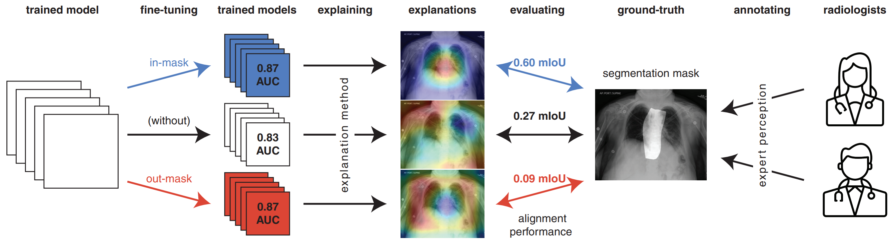

# Section 2: Motivation

`motivation` directory contains code used to create the example in Section 2: Motivation.

# Section 4: Experiments 

## Main Scripts

* `scripts/lightning_trainer.py` trains models on CheXpert dataset.
* `scripts/radimagenet_pretraining.py` trains models on RadImageNet dataset.
* `scripts/finetuning_with_masks.py` fine-tuning of models on CheXlocalize dataset with masks.
* `scripts/create_train_val_test_split.py` creates train/val/test splits for CheXpert dataset.
* `scripts/chexlocalize_finetuned_heatmaps.py` generates explanation heatmaps for (mis)aligned models.
* `scripts/chexlocalize_heatmaps.py` generates explanation heatmaps for trained models.

## Notebooks

* `notebooks/linear_regression_localization_accuracy_analysis.ipynb` notebook in which analysis of effects was performed.
* `notebooks/creating_dataset_for_effect_analysis.ipynb` notebook in which dataset for analysis was created.
* `notebooks/generate_explanations_plots.ipynb` notebook used for creation of explanation plots and example images with masks on CheXlocalize.

## Results

`results` directory contains metadata and code used to create figures and tables in Section 4: Experiments.
